# My CTF Journey: From Confusion to Cracked Flags

_By Mriganka Das_

---

## 🎬 How It All Started

It all began with a YouTube search: **"Hacking challenges"**. Among the results, one video title jumped out at me — _"I Played Beginner-Level Security CTFs For 30 Days - Here's What I Learned"_ by Grant Collins. That single video became my turning point. It gave me direction when I felt bored and lost after a year.

---

## 🧠 What Are CTFs?

Capture The Flag (CTF) challenges are puzzle-like problems designed to teach cybersecurity concepts. They range across different genres:

- Web
- Forensics
- Cryptography
- Binary Exploitation
- Reverse Engineering (my favorite!)
- Pwn

---

## 🚀 First Stop: picoCTF

Inspired, I created an account on [picoCTF](https://picoctf.org/). The interface was clean and easy to navigate. I filtered for **Reverse Engineering**, found 64 challenges, and dove in.

### Challenge 1: _Transformation_

A file named `enc` with no extension was attached. Running `file enc` on Linux told me it was a text file. Inside, I saw weird Chinese-like characters. Below the challenge description was this Python snippet:

```python
''.join([chr((ord(flag[i]) << 8) + ord(flag[i + 1])) for i in range(0, len(flag), 2)])
```

I broke it down line by line, trying to understand bitwise shifts and character encodings. Despite all efforts, I hit a wall. I felt frustrated — even considered giving up and learning drawing instead. But nope — this ain’t a Disney movie, and I’m not quitting.

So I _cheated_, kind of. I Googled for a write-up. Turned out even the writer I found had copied it from someone else. 😅 Eventually, I understood the trick: the code was an **encoder**, not a decoder — my job was to reverse it. Lesson learned.

> "Everything that looks familiar isn’t always the same." 🔁

---

### Challenge 2: _Keygenme-py_

I downloaded `keygenme-trial.py`. It was a calculator app with a locked feature that required a key. After reading the source, I figured out how the check_key() function worked:

- The first half of the key was static
- The second half was a SHA256 hash

I used print statements to manually debug and rebuild the key. Finally got the flag:

```text
picoCTF{1n_7h3_|<3y_of_01582419}
```

---

## 🖥️ Linux Life: Manjaro KDE Edition

I switched from Linux Mint to **Manjaro KDE** for its customization and style. After two hours of tweaks, my setup felt like a hacker’s workstation. 😎 Still, I missed Microsoft Office (cracked version, of course), so I used Google Docs.

---

## 🎮 Trying New Categories

After a bunch of RE challenges, I checked out other genres.

### General Skills Challenge: _File Copy-Paste_

Yup. Literally copy-pasting a flag from a file. Humbling.

### Python Wrangling:

A Python script with password and flag files. After decrypting it using the script and password, I got:

```text
picoCTF{4p0110_1n_7h3_h0us3_68f88f93}
```

### Netcat Challenge: _Nice netcat_

```bash
nc mercury.picoctf.net 49039
```

The response was a series of ASCII numbers. Wrote a Python script to convert it into characters:

```text
picoCTF{g00d_k1tty!_n1c3_k1tty!_3d84edc8}
```

---

## 🔬 Reverse Engineering Again: _Static ain’t always noise_

Two files: a binary and a script to extract its `.text` section. I:

1. Made the binary executable
2. Ran the script
3. Used grep to search for 'pico' in the strings

```bash
cat static.ltdis.strings.txt | grep pico
```

Flag found:

```text
picoCTF{d15a5m_t34s3r_ae0b3ef2}
```

---

## 📡 Exploring WiFi & MITM

Living in a PG, I became curious about what I could do as a WiFi user. I learned about **Ettercap**, **ARP poisoning**, and **Man-in-the-Middle (MITM)** attacks. This opened up a whole new field to explore.

> "Between source and destination, where do our packets really go?"

---

## 💡 Final Thoughts

This journey wasn’t smooth. I faced confusion, frustration, and even considered quitting. But each flag I captured gave me more clarity and confidence.

CTFs helped me:

- Think like a hacker
- Practice real tools and techniques
- Discover a passion for RE and networking

And this is just the beginning.

---

**Stay curious. Break stuff. Learn more.**

~ Mriganka Das

[GitHub](https://github.com/turtlebeasts)

**MY journey INTO H@cK!N9**

I got a source of starting my basic steps into hacking is by going through the first few minutes of this video I found on youtube:

[I Played Beginner-Level Security CTFs For 30 Days - Here's What I Learned](https://youtu.be/Zw25_ySOrC0)

I searched for “Hacking challenges” on youtube and I found this video. The title of this video had really attracted me to watch this and to know what really happened to this guy after 30 days.

And so I’ve also started to follow the same path.

This is me : ~**Mriganka**

Passionate about computers

And how do they work

**Starting of with CTFs**

According to what I’ve learned, **_CTFs_** are some small tricky challenges that we can find on the internet to make us understand how a particular type of softwares works and how a hacker's mind should understand the functioning of that software.

**Which CTF should I try?**

As I’ve seen in the video, ‘Grant Collins’ ~ (the guy in the video), he talked about two CTFs:

1. PicoCTF
2. VulnHub: Mr. Robot

Before I jump into these websites and start breaking stuff and frustrating myself with failures, I want to complete the video and give a like: because it inspired me to work on something. Basically it gave me a direction towards which I should go.

**Sections in a CTF (Types of challenges)**

A CTF has many different types of challenges from where we can start, and according to me these challenges are not interlinked with each other. Basically all the challenges are of different genres (kind of).

1. Web
2. Forensic
3. Crypto
4. Binary Exploitation
5. **Reverse Engineering \***
6. Pwn

And much more…

Yes I’ve marked _reverse engineering_ with an asterisk and bold because I like that challenge category. So I’ll start with that challenge only.

**Inside picoCTF**

After signing up and verifying my email, I was gratefully welcomed inside the website, with a hell lot of annoying notifications.

The user interface was really good (**Why?** Because I can understand where is what), and everything was very smooth.

**Finding what I need (Reverse Engineering)**

**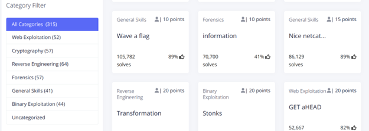**

I found the category filter from which I can clearly see the different challenges I can choose to start from. So I found the reverse engineering challenges, it had 64 of these types of challenges in it.

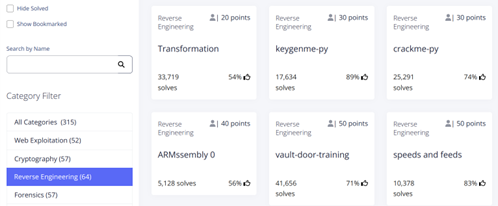

Each challenge had its own points according to its difficulty, the challenge name (which itself is a hint that tells you how we should think of solving the challenge), total number of solves, and total likes that the challenge had.

**Challenge 1 (Transformation)**

Since I’m already a master of these types of challenges so I thought of starting off with the first challenge.

**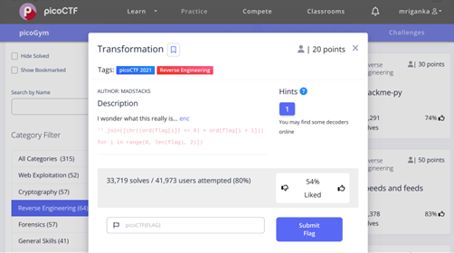**

The description itself seems to be in doubt about this file, “I wonder what this really is”. A file named ‘enc’ without an extension was attached to it.

My steps

I downloaded that file and checked it with the _file_ command in linux.

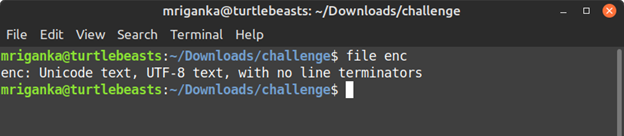

It says it's just a normal text file. So I checked the contents inside of it.

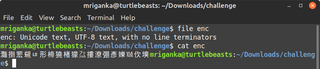

Checking the file content, I found some **Chinese** looking texts in it. So I went on to translate this into **English** and this is what I found.

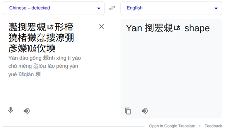

That’s just it.

After this I don’t know what to do and where to go. I have no clue about this file and no idea where I should go and what to think of it. 😐

**The red color texts (That seems to be python code)**

I took a look at the code below the description, but I didn’t know what it does and why even it was there. So I made a separate python file and ran the code in it.

```

''.join(\[chr((ord(flag\[i\]) << 8) + ord(flag\[i + 1\]))

for i in range(0, len(flag), 2)\])

```

It seems there was an error, so I carefully looked at the code. It seems that the code was trying to do something.

**Breaking down the code**

First part:

join() keyword is a python token which is used to join some characters to make a string, and there is a for loop in it. So basically I just have a little idea that the code is looping through a string variable and for each variable it’s doing something inside the loop and joining that result into a string.

Second part:

chr() keyword is a function that takes a unicode and returns the corresponding character in an ascii table. Well I know that.

Third part:

ord() function returns the unicode representing the character passed into it.

For example: _ord(‘a’)_ **#this will return 97**

Fourth part:

Bitwise operator ‘<<’ inside the ord() function. A bitwise operator, although I don’t have much experience with it and I’ve never used it in my coding journey, not even once maybe.

I’ve learnt that the ‘<<’ operator gives us the result of power, that means it’s the same as pow(2, 3) in **c language**.

Overall summary

```
for i in range(0, len(flag), 2)
```

The above code is running a loop, skipping a number, and I guess the flag is an array where I have to put the contents of the file.

I don’t know and at this point I’m very much frustrated and I don’t know what to do. As far as I’ve understood, the code takes two characters and does some bitwise operations on those two characters and then converts it into character and joins it, resulting in the flag. I know that's the whole point of this code.

But as much as I’m trying to run this code, tweaking some and testing with different parts of the code, it's just showing some errors that the chr() function argument is too large.

**Frustration**

_“At this point I want to quit.”_

I know it's a good decision to change our passion when we know that we can’t do anything with it in future. So now I’m thinking of jumping into drawing classes and learning how to draw, at least there I don’t have to put so much effort in thinking and researching. So this documentation ends here and from this point onwards I’ll be making drawing documentation.

You might think that I’ve quit? Fuck no, this is not a TV show, and not a Disney movie that in the end something magical will happen and suddenly I’ll realise that I have this super power of hacking into stuffs like a real badass. Well fuck you…

Some inspiring words:

_Well I’m going to cheat on this one,_

_and maybe on the next one too_

_~Mriganka_

**The cheating process**

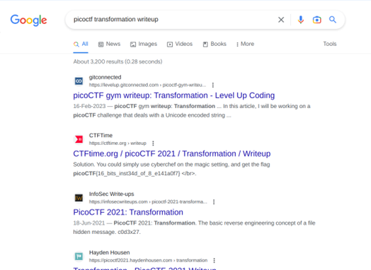

**Found it**

“_But I’m cheating from a cheater!_”

The cheat that I found on google, he made a writeup but he himself didn’t solved it, he cheated from another guy, see:

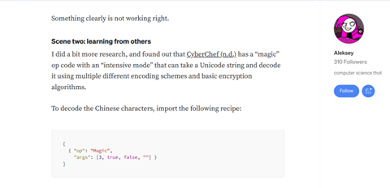

Even the pros cheat, so why shouldn’t I?

In order to solve it, I can just copy and paste this code into the website he suggested, but to understand the solution, I have to look into other solutions.

So I clicked on the third result and found the solution. Basically I went to the website that converts the ascii characters into base64 and I found this

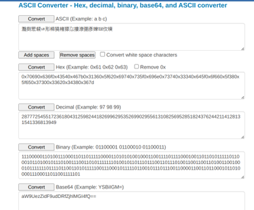

And the base64 looked something similar to what I’ve previously done in the crypto challenges.

I copied the base64 and went on to decode it with an online decoder and found this:

**ioT{6bt_nt4_f8e0b8}**

It still doesn’t look like the flag, well lets see. Yup it doesn’t work. The flag that I’m supposed to submit starts with ‘picoCTF’ and looks something like ‘picoCTF{flag…}’.

So I’ve moved along and found that the code that was given in the description is the code that is used to encode the flag, so all I had to do was reverse the algorithm. I thought that the code was given in order to find the flag.

**Dumb me**

How did I forget that if that would’ve been the case then why did they call it a reverse engineering challenge (hacking)? It’s not a programming or beginner’s programming challenge.

summary:

_“Everything that looks like you’ve seen before, is not always the same, the path which you think will be the same, not necessarily it’ll be the same always!”_

**Challenge 2 (Keygenme-py)**

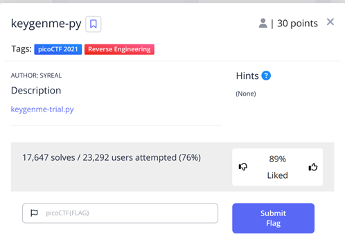

Like before it had a ‘keygenme-trial.py’ named python file attached with no description. So I downloaded that file and then opened it up with python.

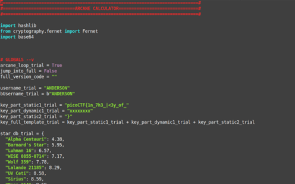

By looking into the source code, we can clearly see that it’s importing hashlib and cryptography, which means it’ll have some hashing and all going on inside. After running the program I found that it is a kind of calculator, and it has a feature which is locked with a key. And that key is most probably the flag for our CTF.

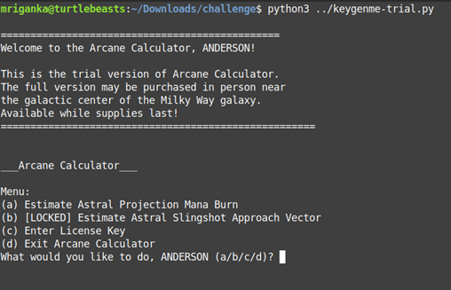

So, again I looked at the source code and analyzed it until I found the code where it checks for the password.

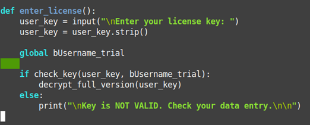

This is the part where it asks the user to enter the key, and after the key is entered it calls the check_key() function where it takes ‘user_key’ and a ‘bUsername_trial’ as a parameter.

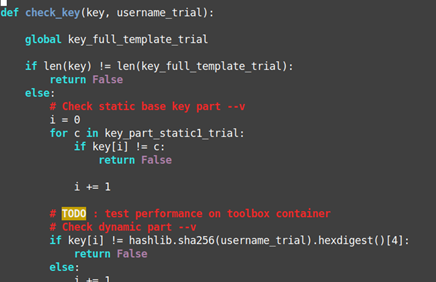

The first part of the function is to check whether the key we entered is of the same length as the: ‘**_key_full_template_trial_**’ variable

Next part is, if the above condition is true, then it’ll loop through the key and check if the first part of our key matches the **_key_part_static1_trial_** variable.

Third part is it’ll check whether the second part of our key is of the value of sha256 hex digested form of the **_username_trial_** variable.

**Solution**

I didn’t do anything, I just printed out the checks and the variables, for example:

The first part of the key can be printed out manually: by adding a **print(key_part_static1_trial)**, the second part of the check function where the dynamic key is checked, there could be various methods of finding out this key, but the one that I’ve did was by printing my key value and the hex digested value respectively for **i**.

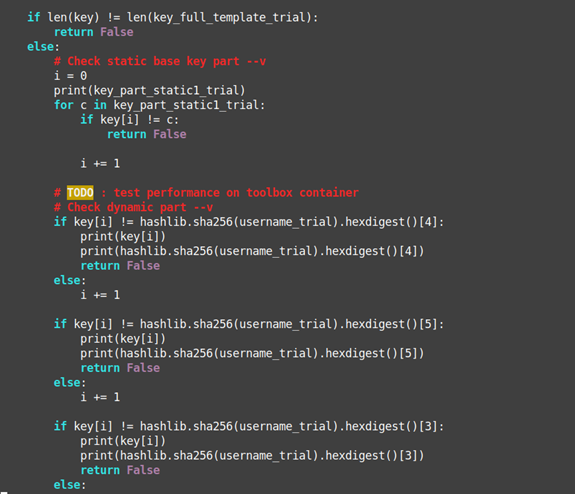

You can see the print statements I’ve added so that I can get the key values that I must’ve entered in place of the **random key values** I’ve provided in the key.

And then one by one I can replace those values with the random key values in the guessed key, and finally obtain the actual flag.

**picoCTF{1n*7h3*|<3y_of_01582419}**

**Summary**

This problem was not so difficult, maybe I’ve not done it in the way the author expected it to be solved, because it was much easier than the first one.

**Feeling like a hacker (Chapter 3)**

Well most people know that to be a successful hacker, we need to have a good knowledge of computers and also, it is very important to have a linux installed, from where we can execute our hacks.

It’s not that I’m a newbie in linux, when I was doing this documentation I was on linux, that why I’m using google docs to write the documentation, because doesn’t matter how much you say that open source softwares are awesome, but deep down, you miss **Microsoft Office 365** (cracked version).

So I've decided to use google docs, on my new linux installation of **Manjaro.**

I was on **linux mint**, and the cinnamon desktop environment was kind of just normal for me. I didn't like **mint** much. So I switched to **Manjaro** with the KDE desktop environment.

The first look of KDE was very overwhelming, but it was again a desktop environment I used before so I wasn’t much surprised to see this kind of look and feel.

So with some customization of about 2 hours now my desktop looks like this:

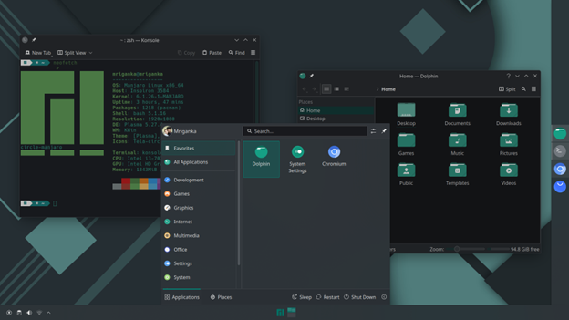

Now I can have a feeling of being a hacker with two or three CTF solves 😎.

I’ve downloaded **Manjaro** from it’s official site, and chose to download the KDE desktop environment, because as long as I’ve experienced, I know that KDE is more stylish and customizable. I followed these two videos and did some tweaks and customizations :

[From Noob To Power User With Manjaro KDE](https://youtu.be/hIDh2HiV_dg)

[Give Your KDE Plasma a Fresh and Elegant Look with Dark Style | Manjaro KDE Plasma](https://youtu.be/KH-VC_wWI1M)

**Enough of reverse engineering (Chapter 4)**

Since I’ve done a lot of reverse engineering challenges, now I want to try some other challenges. So I went to the ‘General skills’ tab and tried the basic challenges.

The first challenge kinda insulted me, telling me that ‘Is that it? Came here for basic challenges? Well then solve this!’

And the first challenge was to basically test if I had the skills to download a file and copy paste the texts from it into the browser. Guess what? I did it for 5 points.

**Challenge 2 (Python wrangling)**

The next challenge was called python wrangling, which tells me that this challenge is based on python.

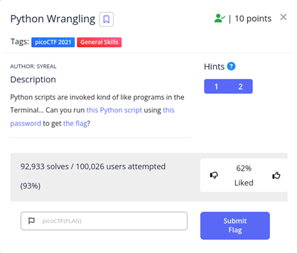

Well it was very simple, I’ve downloaded the python script, the password file and the flag file. Then after a little analysis of the script I learned that the script can either encrypt or decrypt a file using a password. So in order to do that, I did the following, and here’s the flag:

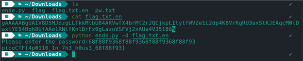

picoCTF{4p0110_1n_7h3_h0us3_68f88f93}

**Nice netcat (challenge 3)**

The next challenge was a good one, first It gave me an address and a port, in which I had to use netcat and it’ll give me a response.

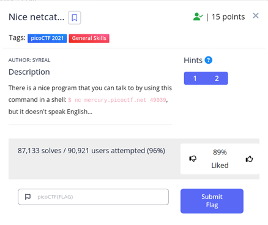

So ran the following command in netcat:

**nc mercury.picoctf.net 49039**

And it produced the following output:

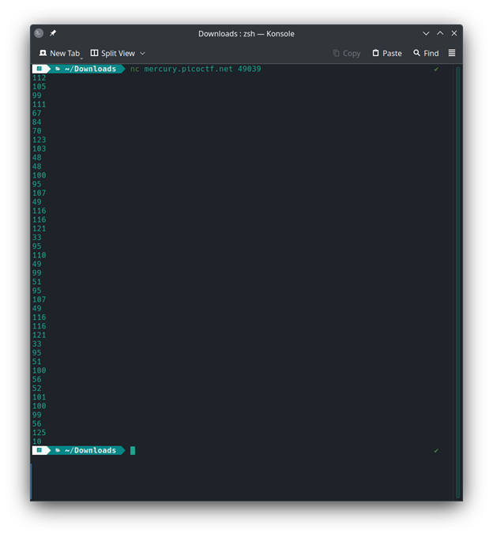

By looking at the numbers I immediately thought of looking at the ascii table, and since the flag format starts with a lowercase ‘p’, and the number 112 in the ascii table represents ‘p’ character, I knew what to do.

I piped the nc output into a text file with the following command so that I can save the output for later conversion using the following command:

**nc mercury.picoctf.net 49039 > flag.txt**

By doing this I saved the output into a flag.txt file, and then I wrote the following python script which basically makes an array using the contents of the flag.txt file and prints the ascii values of the numbers:

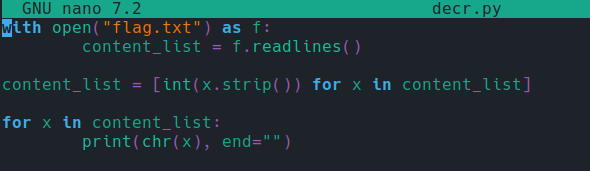

After executing this script it gives us the flag:

**picoCTF{g00d_k1tty!\_n1c3_k1tty!\_3d84edc8}**

**Static ain’t always noise (challenge 4)**

This challenge tested my linux skills, basically this challenge is more like a process of reverse engineering. The challenge gives you two files, the binary itself in which the flag is hidden, and there is another bash script file, that disassembles and extracts the .text section of the binary.

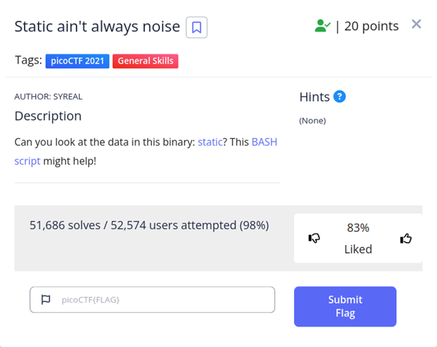

**Solution**

What I did was very simple and it took at most 2 minutes to solve this challenge. I did a simple **chmod +x** operation on the binary to make it executable. Then I ran the bash script with **bash ./ltdis.sh static** after which it saved the disassembly and .text sections in two separate files.

I didn’t even bother to look at the disassembly, all I did was **cat** the **static.ltdis.strings.txt** using **cat** command, and piped it through **grep** to search for a string starting with containing the word ‘pico’.

cat static.ltdis.strings.txt | grep pico

And it gave me the output:

1020 **picoCTF{d15a5m_t34s3r_ae0b3ef2}**

**The new start**

Although I had a little knowledge and idea of how technology works and how to exploit it. I started working on my ideas and trying to convert them into real world hacks. I found that wifi is a great device through which we can modify and tweak around with the connected users and devices. So I basically started working on wifi, trying to look at what information can I get from it and what privileges do I get as a connected user as well as non-connected one?

_Let's get a banner for this new topic_

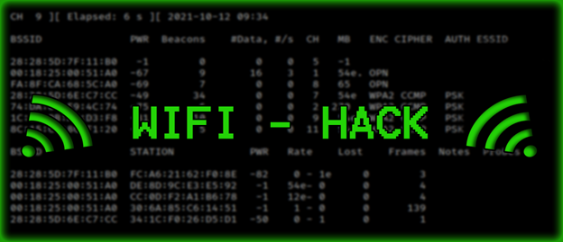

Whenever I think of networking, one thing comes into my mind: between the source and destination, what part of the earth does a computer’s requests and responses travel through? With a quick look around I found that the cable that we use ‘ethernet cable’ and the wireless router ‘wifi’ or our sim card in mobile phones are the medium through which our req/res packets are sent. My idea was to intercept these packets in whichever way it is possible.

**Wifi (wireless interface)**

Since I’m living in a PG, we have routers set up on each floor, where many PG people connect to when they are in their rooms taking rest. The wifi that I am connected to is the same point to which everyone is connecting. My target was this router. I wanted to see if I could tinker with it wirelessly, sending some malicious requests in order to see what kind of information I get from it. So I searched **google** for any tools or commands to do this.

**Ettercap:** Although I’ve found a lot of results among which I’ve discovered _ettercap_. It is a free and open source network security tool to perform **man-in-the-middle** attacks on a LAN.

After downloading this I had a clear understanding of important topics listed below:

Man in the middle

It is basically a scenario where we put in between two communicating devices, which enables us to intercept and control the data that is being sent between these two computers.

ARP-poisoning

It is like fooling the two computers and making them believe that your computer is the destination for both of them. Which puts your computer in between the two devices (router and the target device).
